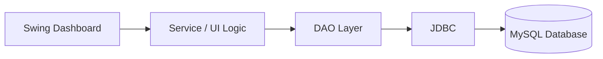
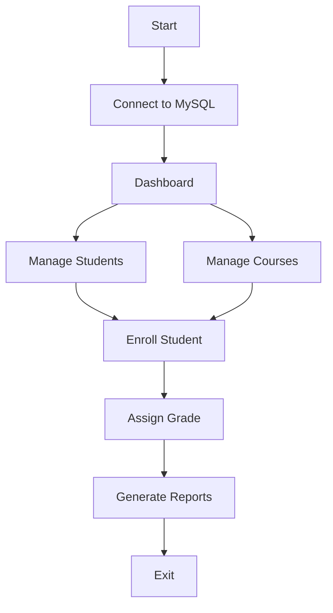
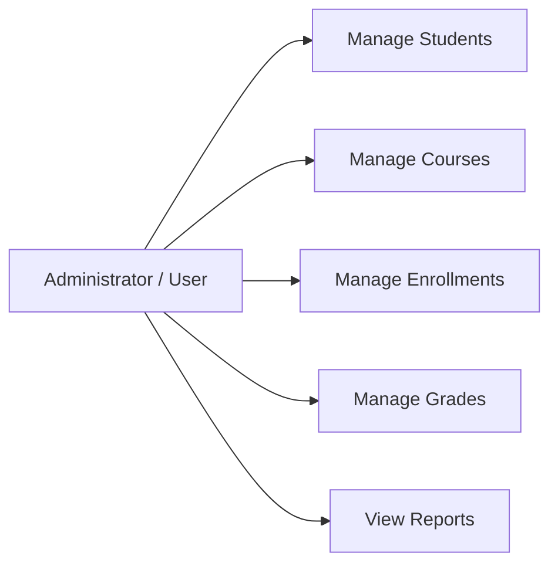
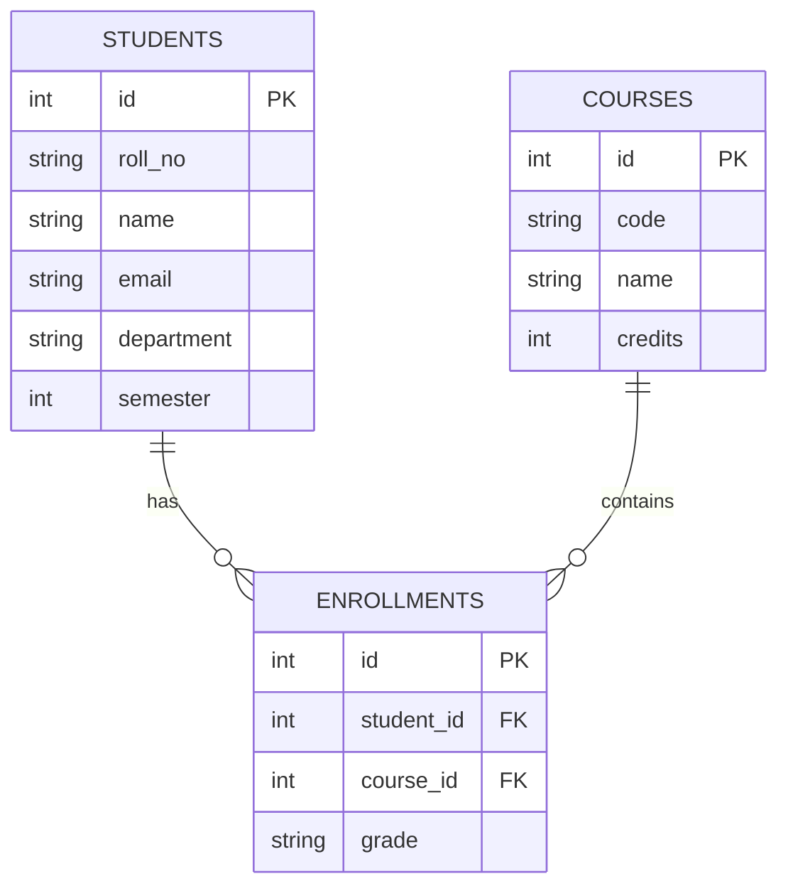

# Design Documentation

## System Architecture

## Workflow

## Use Cases

## ER Diagram

## Non-functional requirements
- Performance: indexed primary/unique keys and parameterized SQL.
- Security: prepared statements; credentials supplied through environment variables.
- Usability: GUI navigation and validation/error dialogs.
- Reliability: relational constraints, duplicate prevention and exception handling.
- Maintainability: package-based layered structure and separate DAO/model/service/UI responsibilities.
